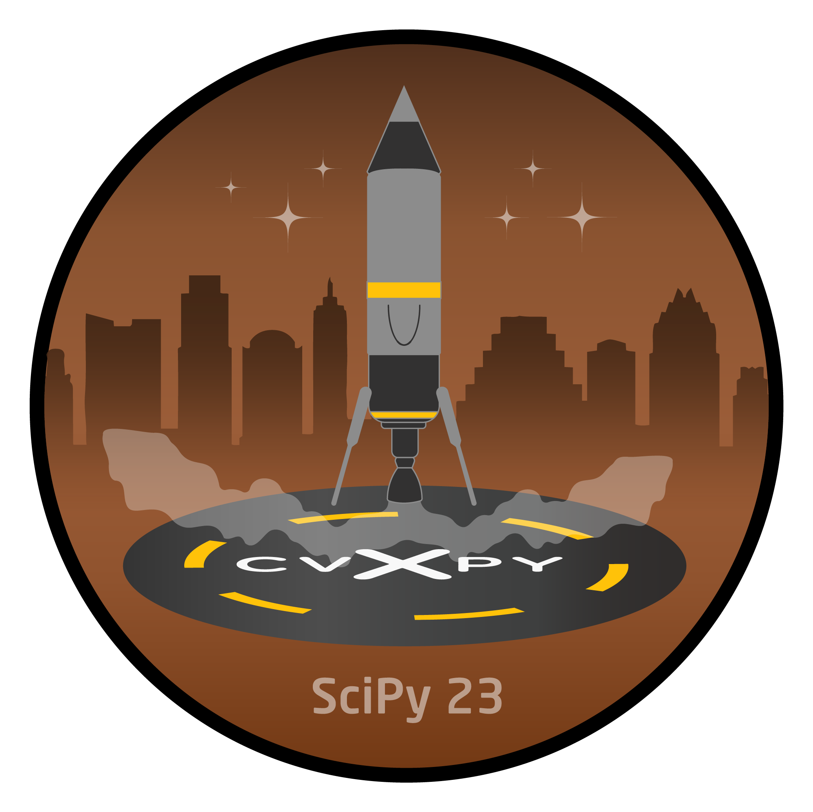
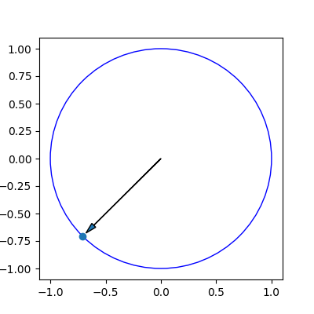

# Controlling Self-Landing Rockets Using CVXPY

This repository contains the installation instructions for a tutorial at SciPy 2023 in Austin, TX. The tutorial will be held on July 10, 2023.
We will provide additional materials here before the tutorial.

We're excited to see you there and hope you enjoy the tutorial!  
The CVXPY Team

<p align="center">

</p>


## Installation
To follow along with the tutorial, you will need to install the following packages, ideally in a fresh virtual environment:
```
cvxpy
scipy
matplotlib
```
CVXPY currently supports Python 3.7-3.11. We are using Python 3.8 for this tutorial, but any of these versions should work.

To verify your installation, run the following commands in a Python interpreter:
```py
import cvxpy as cp
import matplotlib.pyplot as plt
import numpy as np

# Minimize sum of coordinates subject to the unit circle constraint.
x = cp.Variable(2)
constraints = [cp.norm(x, 2) <= 1]
obj = cp.Minimize(cp.sum(x))
prob = cp.Problem(obj, constraints)
prob.solve()
print("status:", prob.status)
print("optimal value", prob.value)
print("optimal var", x.value)

# Plot the solution.
fig, ax = plt.subplots(figsize=(4, 4))
circ = plt.Circle((0, 0), radius=1, edgecolor='b', facecolor='None')
ax.add_patch(circ)
plt.arrow(0, 0, -np.sqrt(.5) + .1, -np.sqrt(.5) + .1, head_width=0.05, head_length=0.1)
plt.scatter(x.value[0], x.value[1])
plt.show()
```
This should produce the following output:

<p align="center">

</p>

### Binder and Codespace
You can also run the notebooks on binder or in a codespace  
[](https://mybinder.org/v2/gh/cvxpy/cvxkerb/HEAD)  
[](https://codespaces.new/cvxgrp/cvxmarkowitz)


### Optional: KSP
If you have the Kerbal Space Program installed, you can optionally install kRPC.
This will allow you to run the code in the `ksp_landing.py` file (will be provided during the tutorial), which uses CVXPY to control a rocket in KSP.
To use kRPC, you need the client as well as the server.
The client can be installed via pip
```
pip install krpc==0.5.3
```

For the server, you can choose from the installation options provided in the [kRPC documentation](https://krpc.github.io/krpc/getting-started.html).
In our case, we downloaded the prebuilt binaries from the [GitHub release](https://github.com/krpc/krpc/releases/tag/v0.5.2) and extracted them to the KSP `GameData` directory.
Note: Use the exact linked release for `v.0.5.2` (even though the pip install is `0.5.3`), as the `0.5.3` release does not contain the server build.
We are using KSP 1.12.5 for this tutorial.

## Tutorial outline
### Introduction [30 min]

- Explanation of the tutorial's purpose and goals
- Explanation of the importance of self-landing rockets
- A brief overview of CVXPY

### Getting started with CVXPY [30 min]

- A single rule for composing convex functions
- The working principles of CVXPY
- Creating a simple optimization problems

### Formulating the rocket landing problem [60 min]

- Identifying the problem's parameters
- Developing the objective function and constraints
- Specifying the optimization problem in CVXPY

### Solving the problem [15 min]

- Using CVXPY to solve the optimization problem
- Interpreting the results

### The mission [60 min]

- Introduction to the Kerbal Space Program and kRPC
- Using CVXPY to control a rocket in KSP
- Launch the rocket and land back on the launchpad

### Advanced features of CVXPY [30 min]

- Performance improvements via parameters (DPP)
- Using CVXPYgen for implementations in embedded systems
- Fastest descent via quasiconvex optimization (DQCP)

### Conclusion [15 min]

- Recap of the tutorial's content and the importance of convex optimization and CVXPY in solving real-world problems